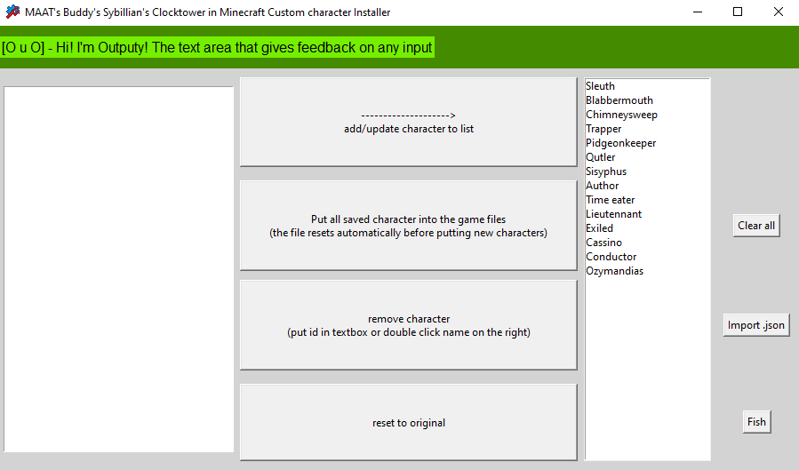

# MAAT's Buddy's Sybillian's Clocktower in Minecraft Custom character Installer
This .exe is all you need* to add all the custom characters you want to [Sybillian's Clocktower in Minecraft](https://modrinth.com/modpack/blood-on-the-clocktower)

*This doesn't automate the whole resource pack (images and moving to the right folder), and I doesn't support travellers or night order.
(These are all planned to work in the future)

Video tutorial
https://www.youtube.com/watch?v=SODU941HsFQ&t=244s

### Known issues
- Putting a character with " in their text will convert it to * to avoid problems.
- The ui for the script can get a bit wonky.

## Set up

1. download the latest release, it should be only an .exe, **that the only file you'll need**, all other files will be created by it

2. go to (**[your server folder]**\resources\datapack\required) and extract the ct.zip into a ct folder

3. Put the .exe in **[your server folder]**\resources\datapack\required\ct\data\ct\function

That 's all!

## How to use
Here's the step by step you'll have to follow every time you need to put custom characters

1. Make sure you have a .json of every character you want to add, or a script with all of them (the script can have vanilla character, they will be ignored), if you're adding characters individually, paste the .json into the left text box and press the "add/update character to list", if you are adding multiple through a script press the "Import .json" and select the script

2. After that, press "Put all saved character into the game files", this will create two files, one with the resource pack and another with the original files

3. go to the resource pack and get to assets\ct\textures\role, you put there the image of the characters, with their name being the **ID**, not the name. If you want you can copy and paste the same images and names into *faded*, but they are only used when the storyteller is building a bag.

4. Now you need to put that resource pack into the right folder (**[your server folder]**\resources\resourcepack\required) (you don't need to zip the folders back)

5. Lastly, you need to find a way to make the client also have this folder, you can find multiple ways to achieve that (just search online)

And done! Now you can open/reload the server and there should be all the characters with image and text for you to play

### Interface
When you first open you'll see something like this:

- On the top there is Outputy, they will give you feedback on any input you make.
- The first text box (on the left) is where you can put your json to save it into the character list (on the right).
- The text on the right is the list of characters saved on customSaved (don't worry, the program will create one if there is none), you can double click any character in this list to show their json on the text box.

- The "add/update character to list" button is to add or update a character into the list, simply paste the json of the character and press the button, their name should appear on the right.
- The "Put all saved characters in the file" button will modify the files, adding all the characters in the list on the right and making a resource pack (Blood on the Moddedtower) and a save with the original files (original_files).
- The "remove character" button removes a character in the list by either putting their id or putting their whole json (double click their name on list).
- The "reset to original" button is to revert all their files to their original form.

- The "clear all" button removes all characters on the list.
- The "Import .json" button opens a window where you can select a script with custom characters, it will add all of them to the list.
- The fish button. ><>

## AI usage
When I first started this project I used AI thinking I wouldn't be able to do it, but I was wrong. Still, the project has old parts of it that were written by AI, but I don't plan on having AI touch this code again. Hopefully this doesn't deter you from the project, it was still made with love, passion and help from the community.

TL;DR: I have a bit of AI from old code but I don't plan on using it anymore.
